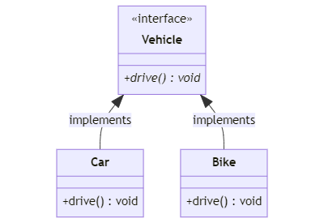
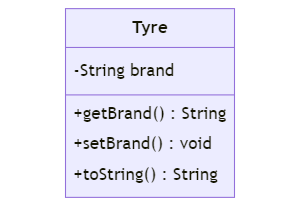

# mySpringProject
This project is created to learn spring framework

Adding some sample Car and Bike class.
In order to achieve loose coupling between the objects, we have to create interface which is 
implemented by Car and Bike class. <br>So adding Vehicle interface with drive abstract method.

<p align="center">
  
</p>

## Dependency Injection with XML Configuration

Adding the springConfig.xml in the project with following configuration

```xml
<beans xmlns="http://www.springframework.org/schema/beans"
    xmlns:xsi="http://www.w3.org/2001/XMLSchema-instance"
    xsi:schemaLocation="http://www.springframework.org/schema/beans 
    http://www.springframework.org/schema/beans/spring-beans.xsd">
	
	<bean id="vehicle" class="com.mygroup.springPractice.Bike"></bean>
</beans>
```

## Annotation based configuration

Changing the springConfig.xml with the following configuration

```xml
<beans xmlns="http://www.springframework.org/schema/beans"
	xmlns:xsi="http://www.w3.org/2001/XMLSchema-instance"
	xmlns:context="http://www.springframework.org/schema/context"
	xsi:schemaLocation="http://www.springframework.org/schema/beans
   http://www.springframework.org/schema/beans/spring-beans.xsd
   http://www.springframework.org/schema/context
   http://www.springframework.org/schema/context/spring-context.xsd">
	
	<context:component-scan base-package="com.mygroup.springPractice"></context:component-scan>
	<!--  <bean id="vehicle" class="com.mygroup.springPractice.Bike"></bean> -->
</beans>
```

then adding ```@Component``` annotation above the Car and Bike class with ```import org.springframework.stereotype.Component```

## bean property

To demonstrate bean property, lets create ```Tyre``` Class

<p align="center">
  
</p>

then adding this bean to the springConfig.xml file
```xml
<bean id="tyre" class="com.mygroup.springPractice.Tyre">
	<property name="brand" value="MRF"></property>
</bean>
```
This way we can pass values to the Tyre class object which is being injected to the main ```App``` class

## Constructor Injection
In order to pass values directly to the constructor while object creation, we have to change the xml as shown below
```xml
<bean id="tyre" class="com.mygroup.springPractice.Tyre">
	<!--	<property name="brand" value="MRF"></property> -->
	<constructor-arg value="Ceat"></constructor-arg>
</bean>
```
and also we have to add constructor method in Tyre class like this
```java
public Tyre(String brand) {
	super();
	this.brand = brand;
}
```