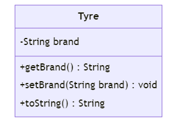

# mySpringProject
This project is created to learn spring framework

Adding some sample Car and Bike class.
In order to achieve loose coupling between the dependencies, we have to create interface which is 
implemented by Car and Bike class. <br>So adding Vehicle interface with drive abstract method.

<p>
  
</p>

## Dependency Injection with XML Configuration

Adding the springConfig.xml in the project with following configuration

```xml
<beans xmlns="http://www.springframework.org/schema/beans"
    xmlns:xsi="http://www.w3.org/2001/XMLSchema-instance"
    xsi:schemaLocation="http://www.springframework.org/schema/beans 
    http://www.springframework.org/schema/beans/spring-beans.xsd">
	
	<bean id="vehicle" class="com.mygroup.springPractice.Bike"></bean>
</beans>
```

## Annotation based configuration

Changing the springConfig.xml with the following configuration

```xml
<beans xmlns="http://www.springframework.org/schema/beans"
	xmlns:xsi="http://www.w3.org/2001/XMLSchema-instance"
	xmlns:context="http://www.springframework.org/schema/context"
	xsi:schemaLocation="http://www.springframework.org/schema/beans
   http://www.springframework.org/schema/beans/spring-beans.xsd
   http://www.springframework.org/schema/context
   http://www.springframework.org/schema/context/spring-context.xsd">
	
	<context:component-scan base-package="com.mygroup.springPractice"></context:component-scan>
	<!--  <bean id="vehicle" class="com.mygroup.springPractice.Bike"></bean> -->
</beans>
```

then adding ```@Component``` annotation above the Car and Bike class with ```import org.springframework.stereotype.Component```

## bean property

To demonstrate bean property, lets create ```Tyre``` Class

<p>
  
</p>

then adding this bean to the springConfig.xml file
```xml
<bean id="tyre" class="com.mygroup.springPractice.Tyre">
	<property name="brand" value="MRF"></property>
</bean>
```
This way we can pass values to the Tyre class object which is being injected to the main ```App``` class

## Constructor Injection
In order to pass values directly to the constructor while object creation, we have to change the xml as shown below
```xml
<bean id="tyre" class="com.mygroup.springPractice.Tyre">
	<!--	<property name="brand" value="MRF"></property> -->
	<constructor-arg value="Ceat"></constructor-arg>
</bean>
```
and also we have to add constructor method in Tyre class like this
```java
public Tyre(String brand) {
	super();
	this.brand = brand;
}
```

## Autowired Injection

For this, We have created tyre object in the Car class field. So this means that our Car class depends upon Tyre class.<br>
To automatically inject the tyre object, we have to use ```@Autowired``` annotation from ```import org.springframework.beans.factory.annotation.Autowired``` above the object like shown below
```java
@Autowired
private Tyre tyre;
```
For this demo, we are using annotation based configuration for Tyre class as well. So we have added ```@Component``` annotation above the Tyre class name and commented the construction method as it is not required for this demo and modified toString method. In addition to that, we also have to comment out the following xml code as
```xml
<!-- 	<bean id="tyre" class="com.mygroup.springPractice.Tyre"> -->
<!-- 		<constructor-arg value="Ceat"></constructor-arg> -->
<!-- 		<property name="brand" value="MRF"></property>  -->
<!-- 	</bean> -->
```
## Complete Annotation based Configuration | Bean configuration
For this demo, we have created classes and interface in the following UML diagram fashion

<p>
    
</p>

In this case, all the bean configurations reside in the class, we used ```AppConfig.java``` class for bean configuration.
That means, we no longer need xml file to configure our beans. In the previous examples, we were using ```ClassPathXmlApplicationContext``` class to set the xml configurations, now we have to use different class called ```AnnotationConfigApplicationContext``` which takes in our ```AppConfig.class``` as input and sets the bean configuration.

So whenever we have a class which depends on other class, we have to ensure that we have created the bean for it in the ```AppConfig.java``` class and we are using ```@Autowired``` annotation above the object instance.

Example: Following code in our main ```App.java``` shows Samsung object being injected by bean configuration which resides in ```Appconfig.java```
```java
ApplicationContext factory = new AnnotationConfigApplicationContext(AppConfig.class);
Samsung s7 = factory.getBean(Samsung.class);
s7.specs();
s7.getCpu().process();
```

To confure beans in ```AppConfig.java```, we have to create methods that returns respective object, in this case we want Samsung and MobileProcessor object.
so our AppConfig class will look like this
```java
package com.mygroup.springPractice;

import org.springframework.context.annotation.Bean;
import org.springframework.context.annotation.Configuration;

@Configuration
public class AppConfig {
	
	@Bean
	public Samsung getphone() {
		return new Samsung();
	}
	
	@Bean
	public MobileProcessor getprocessor() {
		return new Snapdragon();
	}
}

```
here method name does not matter, only type of return matters for object injection.

## Annotations: Component, Autowired, Primary, Qualifier

In the previous example, we had defined our beans configuration in the AppConfig class with ```@Bean``` annotation. There is another way to achieve the same without actually adding any configuration methods.

To achieve that simplicity, there are some steps
1. Add the ```@ComponentScan(basePackages = "PACKAGE_NAME")``` annotation above the config class definition as shown below

    ```java
    package com.mygroup.springPractice;

    //import org.springframework.context.annotation.Bean;
    import org.springframework.context.annotation.ComponentScan;
    import org.springframework.context.annotation.Configuration;

    @Configuration
    @ComponentScan(basePackages = "com.mygroup.springPractice")
    public class AppConfig {
        
    //	@Bean
    //	public Samsung getphone() {
    //		return new Samsung();
    //	}
    //	
    //	@Bean
    //	public MobileProcessor getprocessor() {
    //		return new Snapdragon();
    //	}
    }
    ```
2. Ensure that every class in the package has ```@Component``` annotation

and that's it. This is how simple it is.

We may come accross scenario like we have mulitple implementation of a same interface, for example, we may have two implementation of ```MobileProcessor``` interface like Snapdragon and Mediatek. So in this case, it will ambiguous to java that which object to provide when asked for MobileProcessor. So we two solutions
1. ```@Primary``` annotation:<br>
   This annotation is used above the class whose object that we want to provide by default when asked for MobileProcessor object.
   Example:
   ```java
    import org.springframework.context.annotation.Primary;
    import org.springframework.stereotype.Component;

    @Component
    @Primary
    public class Snapdragon implements MobileProcessor
   ```

2. ```@Qualifier``` annotation:<br>
   This annotation is used when we want to decide which object we want while instantiating the MobileProcessor object.
   For Example:
    ```java
    @Autowired
	@Qualifier("mediatek")
	private MobileProcessor cpu;
    ```
   
   
